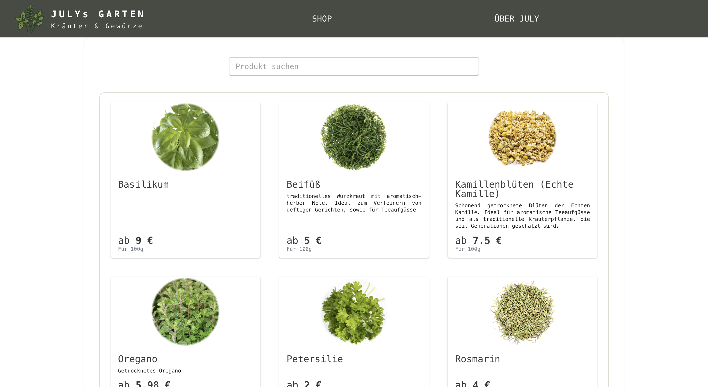
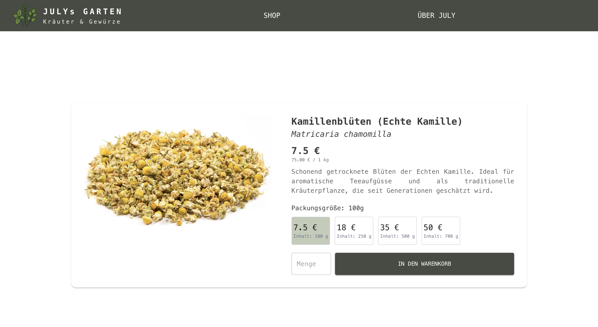
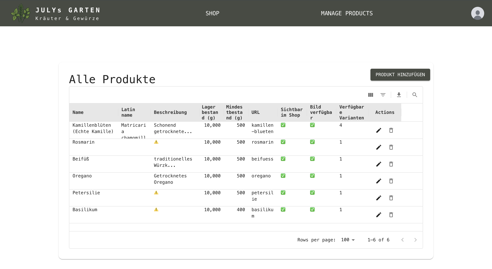
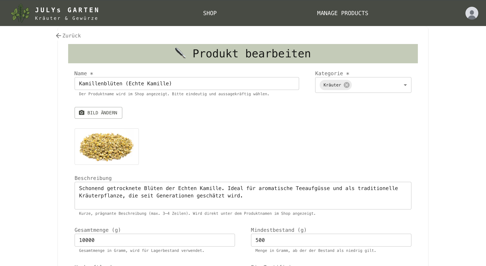

# Herbs Shop Frontend 🌿

A React + TypeScript SPA for a herbs & spices shop. Built with Vite and MUI, talking to a Node/Express + Prisma + PostgreSQL API.

Backend repo: [herbs-shop-server](https://github.com/malejaroti/my-life-timelines-backend)

<div align="center">
  
  
  
  
</div>

## 🧩 Project Context
This project was developed as an assignment for the final complementary module of a Web Development Bootcamp offered by Ironhack.

It was built within a few days to demonstrate proficiency with **TypeScript**, **PostgreSQL**, and **Prisma**. (For the last two, check [backend repo](https://github.com/malejaroti/my-life-timelines-backend).)

## 🚀 Core Features
- **Shop page**: Catalog browsing and search by product name.
- **Product details page**: Dedicated product information page with support for different package sizes and pricing (i.e. different variants)
- **Authentication:** Auth UI for admin login.
- **Admin Controls**: Product management panel for easier visualization and deletion of products. 
- **Product edit form** : Dedicated page to add and edit product data.
- **Image Management**: Product image upload functionality with cloud-storage in Cloudinary.

- ℹ️ Not yet implemented: cart/checkout (Stripe), orders, user profile.

## 🛠️ Tech Stack

- **Frontend Framework**: React 19 with TypeScript
- **Build Tool**: Vite
- **Styling**
  - **UI Library**: Material-UI (MUI) v7. Advanced components used:  MUI X Data Grid for product management panel.
  - Tailwind CSS v4
- **Routing**: React Router v7
- **HTTP Client**: Axios
- **Icons**: Material-UI Icons
- **State Management**: React Context API

## 📁 Project Structure

```
src/
├── components/          # Reusable UI components
│   ├── auth/           # Authentication-related components
│   ├── layout/         # Layout components (Navbar, PageShell)
│   └── styled/         # Styled components
├── context/            # React Context providers
├── pages/              # Page components
├── services/           # API service configurations
├── types/              # TypeScript type definitions
├── assets/             # Static assets
└── App.tsx            # Main application component
```

## 🛒 Product Features

### Product Types
- **Herbs**: Medicinal and culinary herbs
- **Spices**: Various spices and seasonings

### Product Information
- Name and Latin name
- slug (autogenerated)
- Origin country
- Organic certification status
- Description
- Multiple product variants with different:
  - Package sizes (in grams)
  - Pricing

## 👨‍💼 Admin Features
The admin panel features a sophisticated interface powered by a [MUI X Data Grid](https://mui.com/x/react-data-grid/) for product listing
.<div align="left">
  
</div>

**Built-in Features**: The table has built-in features such as sorting, filtering, column management, and pagination out of the box


### Admin Capabilities
Admin users can:
- Create new products with multiple variants
- Update existing product information
- Manage product images
- Control product availability
- View and manage products through the advanced data grid interface

## 🚦 Getting Started

### Prerequisites

- Node.js (v18 or higher)
- npm

### Installation

1. Clone the repository:
```bash
git clone https://github.com/malejaroti/herbs-shop-frontend.git
cd herbs-shop-frontend
```

2. Install dependencies:
```bash
npm install
```

3. Start the development server:
```bash
npm run dev
```

4. Open your browser and navigate to `http://localhost:5173`

## 📜 Available Scripts

- `npm run dev` - Start the development server
- `npm run build` - Build the application for production
- `npm run preview` - Preview the production build locally
- `npm run lint` - Run ESLint for code quality checks

## 🔧 Configuration

### Environment Variables

Create a `.env` file in the root directory and add:
```env
VITE_API_URL=your_backend_api_url
```

### Tailwind CSS
Tailwind CSS v4 is configured with the Vite plugin for optimal performance.

## 🗺️ Roadmap (Next Steps)
- 🛒 Cart & Checkout (Stripe)
- 👤 Account area (orders, addresses)

## 🤝 Contributing

1. Fork the repository
2. Create a feature branch (`git checkout -b feature/amazing-feature`)
3. Commit your changes (`git commit -m 'Add some amazing feature'`)
4. Push to the branch (`git push origin feature/amazing-feature`)
5. Open a Pull Request

## 🐛 Issues

If you encounter any issues, please file them in the [Issues](https://github.com/malejaroti/herbs-shop-frontend/issues) section of the repository.

---

Built with ❤️ for the sake of learning and for July, and all other herb and spice enthusiasts
